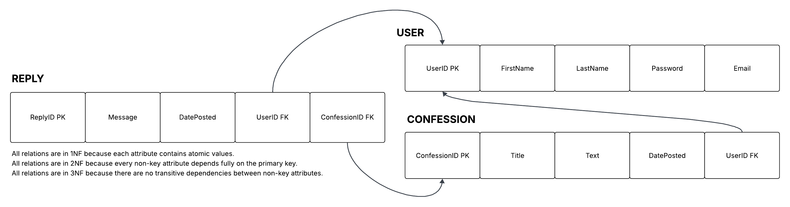

# Sweetheart Database Design

## Description
Users can create accounts, log in, and post confessions. Other users can reply to those confessions, allowing interaction within the application.

## ER Diagrams

### Basic ERD
This diagram shows the core structure of the application, including the main entities (User and Confession) and their relationship. It represents how users create confessions in the system.

### Possible Extension
This diagram extends the basic design by adding the Reply entity, allowing users to interact with confessions. It demonstrates how the database can support additional features like user replies.

## Relations
This diagram shows how the entities are converted into relational tables with primary and foreign keys. It represents how the database will be structured for implementation.

